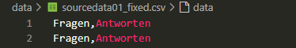
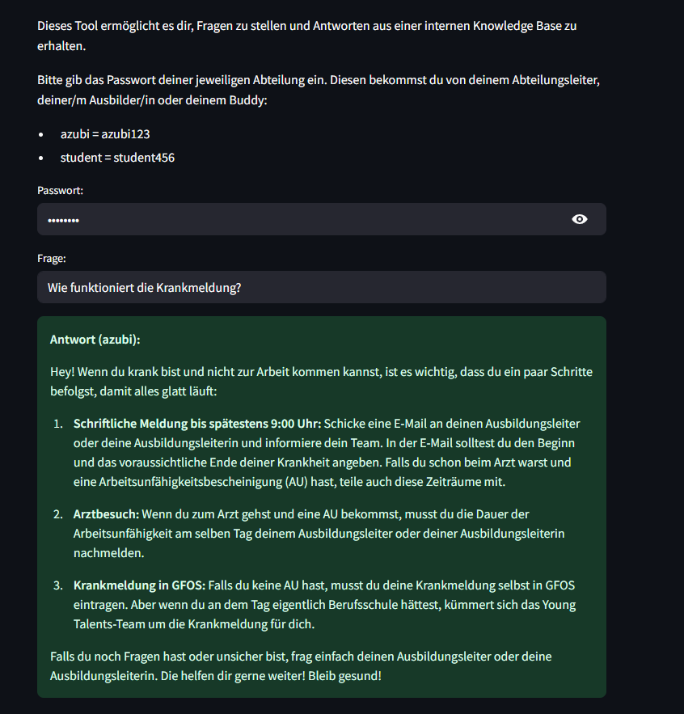
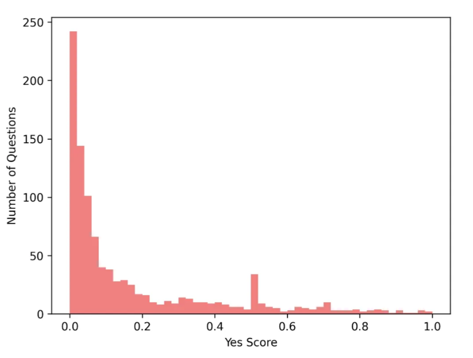
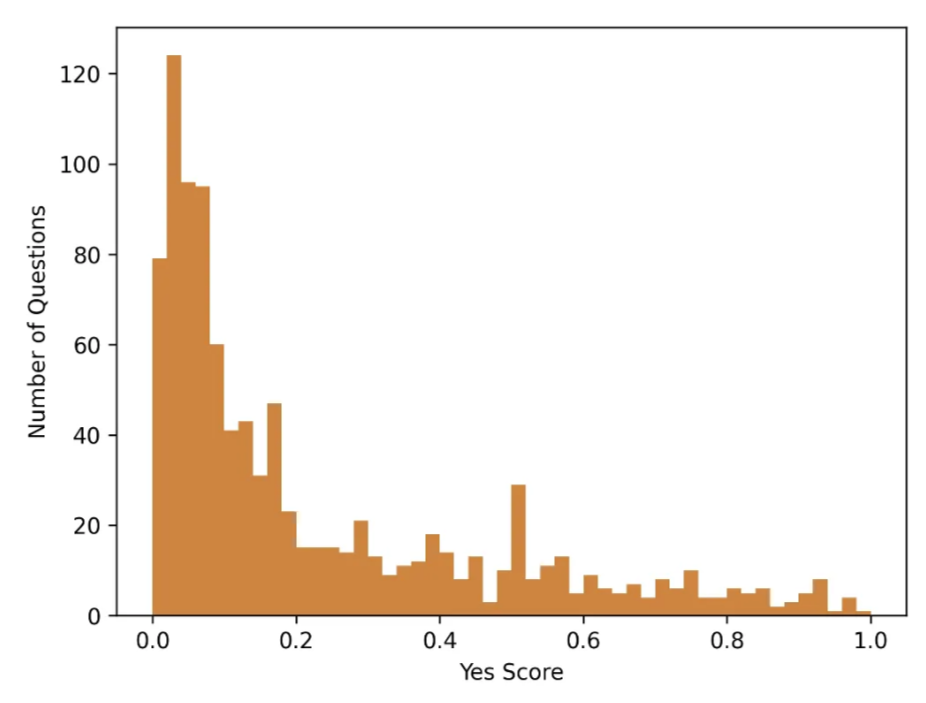
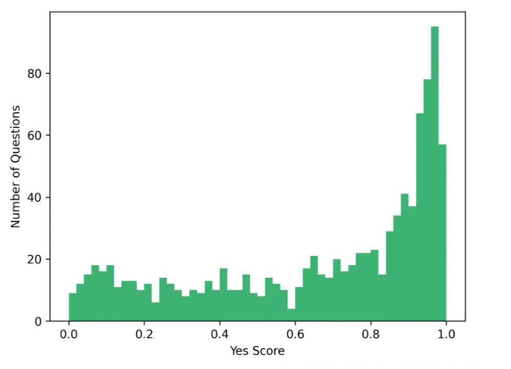

# Interne Demo: RAG-FAQ für OD

Dieses Projekt stellt eine interne Frage-Antwort-Anwendung bereit, die auf dem RAG-Ansatz (Retrieval-Augmented Generation) basiert. Die Daten aus einer CSV-Datei werden lokal in einer FAISS-Vektordatenbank gespeichert. Die Antwortgenerierung erfolgt mithilfe der OpenAI-API (GPT-3.5-Turbo).

Hinweis: FAISS wurde statt ChromaDB gewählt, da es lokal effizienter läuft, weniger Ressourcen verbraucht und sich gut für schlanke, lokale Demos eignet.


## Funktionsweise

Das System durchsucht auf Basis eines Embedding-Vergleichs (Vektorsuche) die relevantesten Einträge in der Datenbank und stellt dem OpenAI-Modell (z. B. GPT-3.5) diese als Kontext zur Verfügung. Nur basierend auf diesem Kontext wird eine Antwort erzeugt.


## Einrichtung

### 1. Virtuelle Umgebung erstellen und aktivieren (.venv)
```bash
python -m venv .venv
.\.venv\Scripts\activate
```

### 2. requirements installieren
```bash
pip install -r requirements.txt
```

### 3. environment definieren
Lege eine Datei `.env` an (oder kopiere `.env.example`) mit folgendem Inhalt:
```env
OPENAI_API_KEY=your-api-key-here
GPT_MODEL=gpt-3.5-turbo
```

GPT-3.5 ist ideal für kompakte Antworten in FAQ-Formaten, weil es zuverlässig, schnell und günstig arbeitet.


## Nutzung

### 1. Datenbank aus CSV erzeugen
```bash
python create_database.py
```

Nach Ausführung solltest du im Verzeichnis `faiss_index/` mehrere `.faiss`-Dateien sehen.  


**Hinweis:** Wenn der Ordner leer bleibt wurde die Datenbank nicht korrekt erstellt. Stelle sicher, dass:
- Die CSV-Datei vorhanden und korrekt formatiert ist


- Die `.env`-Datei gültige API-Zugänge enthält


### 2. Anwendung starten (mit Web-Oberfläche | STREAMLIT)
```bash
streamlit run streamlit_app.py
```

Dies öffnet eine interaktive FAQ-Oberfläche im Browser, über die du direkt Fragen stellen kannst.

## Eigene CSV-Datei(en) verwenden

Um eigene Inhalte zu verwenden, erstelle im `data/`-Ordner eine Datei (z. B. `faq.csv`) mit folgendem Aufbau:

| Fragen                  | Antworten                                                                 |
|-------------------------|---------------------------------------------------------------------------|
| Was tun bei IT-Problemen? | Kontaktieren Sie bitte den IT-Support unter support@firma.de.               |

Die Spaltenüberschriften Fragen und Antworten sind verpflichtend.



## Projektstruktur

| Datei / Ordner     | Beschreibung |
|--------------------|--------------|
| `create_database.py` | Erstellt die Datenbank (FAISS)auf basis der daten von data/|
| `query_data.py`     | Durchsucht die Datenbank  und generiert eine Antwort |
| `streamlit_app.py`  | Streamlit-basierende GUI |
| `data/`             | enthält die CSV-Datenquelle, bei formatabweichung diese Logik dem programm anpassen! |
| `faiss_index/`      | persistente Vektordatenbank (wird automatisch erstellt mit create_database.py) |
| `.env.example`      | Vorlage für Umgebungsvariablen |

## Voraussetzungen

- Python 3.10 (oder höher)
- Gültiger OpenAI API Key 
- Optional: Streamlit (für GUI)

## Beispielausgabe

```bash
Frage: Wie melde ich mich krank?

Antwort: Bitte melden Sie sich vor Arbeitsbeginn telefonisch bei Ihrer Führungskraft.
```




---

## Anpassung des Confidence Scores

Um die Relevanz einer Antwort zu bewerten, wird ein sogenannter Confidence Score verwendet. Dieser Wert liegt zwischen `0` und `1` und gibt an, wie sicher das System ist, dass der zurückgegebene Kontext zur gestellten Frage passt.

### Code-Snippet zur Anpassung

In der Datei `query_data.py` (bzw. wo die `run_query()`-Funktion also liegt), kann der Confidence Score angepasst werden. Die Standardgrenze für die ich mich entschieden habe liegt bei `0.5`. Treffer darunter werden als irrelevant gewertet:

```python
if not results or results[0][1] < 0.5:
    return "KEINE PASSENDEN ERGEBNISSE GEFUNDEN. Bitte versuche es mit einer anderen Frage."
```

Durch Erhöhung oder Senkung dieser Grenze bzw. dieses Wertes lässt sich das Antwortverhalten feinjustieren:

- **Höherer Schwellenwert (z. B. 0.7)** bedeutet: präzisere Antworten, aber mehr „keine Ergebnisse“-Meldungen
- **Niedrigerer Schwellenwert (z. B. 0.3)** bedeutet: großzügigere Antwortfindung, aber potenziell unpassendere/fehlerhafte Ergebnisse

---

### Visualisierung der Auswirkungen

Die folgenden Diagramme zeigen, wie sich unterschiedliche Scores auf die Erkennung von passenden Antworten auswirken:

#### Nicht passende Antworten (Incorrect Responses)
Antworten mit Score < 0.5, obwohl sie keine wirkliche Verbindung zur Frage haben:

```python
if not results or results[0][1] < 0.29:
```



#### Random Related Responses 
Lose verknüpfte, aber semantisch schwache Treffer mit mittlerem Score (0.3–0.6):

```python
if not results or results[0][1] < 0.54:
```



#### Passende Antworten (Correct Responses)
Hohe Scores (ab 0.7) – hier besteht starke Übereinstimmung zwischen Frage und gefundenem Kontext:

```python
if not results or results[0][1] < 0.86:
```



---

Je nach Use Case (präzision oder kulanz) ist dieser Wert frei anpassbar!
