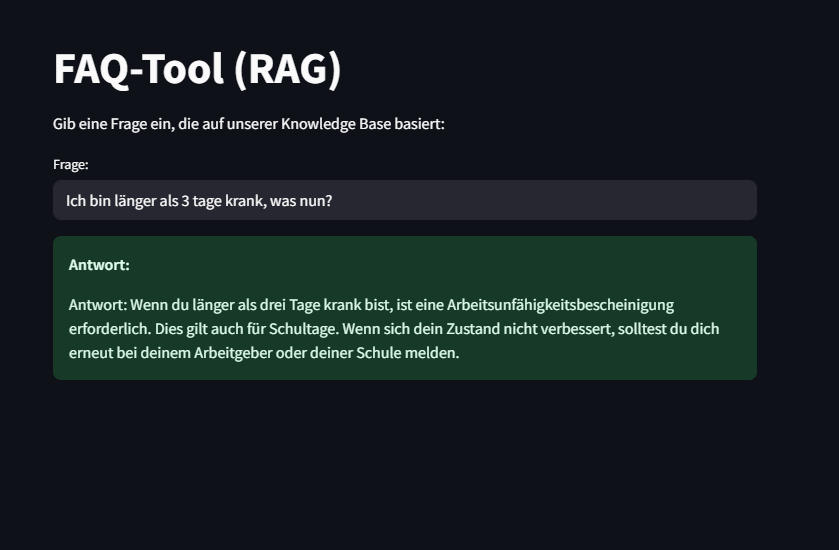

# Interne Demo: RAG-FAQ für OD

Dieses Projekt stellt eine interne Frage-Antwort-Anwendung bereit, die auf dem RAG-Ansatz (Retrieval-Augmented Generation) basiert. Die Daten aus einer CSV-Datei werden lokal in einer FAISS-Vektordatenbank gespeichert. Die Antwortgenerierung erfolgt mithilfe der OpenAI-API (GPT-3.5-Turbo).

Hinweis: FAISS wurde statt ChromaDB gewählt, da es lokal effizienter läuft, weniger Ressourcen verbraucht und sich gut für schlanke, lokale Demos eignet.

## Funktionsweise

Das System durchsucht auf Basis eines Embedding-Vergleichs (Vektorsuche) die relevantesten Einträge in der Datenbank und stellt dem OpenAI-Modell (z. B. GPT-3.5) diese als Kontext zur Verfügung. Nur basierend auf diesem Kontext wird eine Antwort erzeugt.

## Einrichtung

### 1. Virtuelle Umgebung erstellen und aktivieren (.venv)
```bash
python -m venv .venv
.\.venv\Scripts\activate
```

### 2. requirements installieren
```bash
pip install -r requirements.txt
```

### 3. environment definieren
Lege eine Datei `.env` an (oder kopiere `.env.example`) mit folgendem Inhalt:
```env
OPENAI_API_KEY=your-api-key-here
GPT_MODEL=gpt-3.5-turbo
```

GPT-3.5 ist ideal für kompakte Antworten in FAQ-Formaten, weil es zuverlässig, schnell und günstig arbeitet.

## Nutzung

### 1. Datenbank aus CSV erzeugen
```bash
python create_database.py
```

Nach Ausführung solltest du im Verzeichnis `faiss_index/` mehrere `.faiss`-Dateien sehen.  


**Hinweis:** Wenn der Ordner leer bleibt wurde die Datenbank nicht korrekt erstellt. Stelle sicher, dass:
- Die CSV-Datei vorhanden und korrekt formatiert ist


- Die `.env`-Datei gültige API-Zugänge enthält

### 2. Anwendung starten (mit Web-Oberfläche)
```bash
streamlit run streamlit_app.py
```

Dies öffnet eine interaktive FAQ-Oberfläche im Browser, über die du direkt Fragen stellen kannst.

## Eigene CSV-Datei verwenden

Um eigene Inhalte zu verwenden, erstelle im `data/`-Ordner eine Datei (z. B. `faq.csv`) mit folgendem Aufbau:

| Fragen                  | Antworten                                                                 |
|-------------------------|---------------------------------------------------------------------------|
| Wie melde ich mich krank? | Bitte melden Sie sich vor Arbeitsbeginn telefonisch bei Ihrer Führungskraft. |
| Was tun bei IT-Problemen? | Kontaktieren Sie bitte den IT-Support unter support@firma.de.               |

Die Spaltenüberschriften **Fragen** und **Antworten** sind verpflichtend.


## Projektstruktur

| Datei / Ordner     | Beschreibung |
|--------------------|--------------|
| `create_database.py` | Erstellt die FAISS-Datenbank |
| `query_data.py`     | Durchsucht die Datenbank und generiert eine Antwort |
| `streamlit_app.py`  | auf Streamlit-basierende Benutzeroberfläche |
| `data/`             | enthält die CSV-Datenquelle, bei formatabweichung diese Logik dem programm anpassen |
| `faiss_index/`      | Persistente Vektordatenbank (wird automatisch erstellt) |
| `.env.example`      | Vorlage für Umgebungsvariablen |

## Voraussetzungen

- Python 3.10 (oder höher)
- Gültiger OpenAI API Key (https://platform.openai.com/account/api-keys)
- Optional: Streamlit (für GUI)

## Beispielausgabe

```bash
Frage: Wie melde ich mich krank?

Antwort: Bitte melden Sie sich vor Arbeitsbeginn telefonisch bei Ihrer Führungskraft.
```

