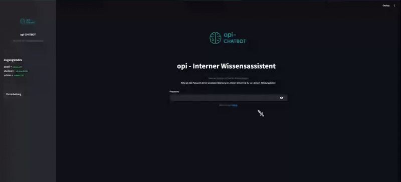
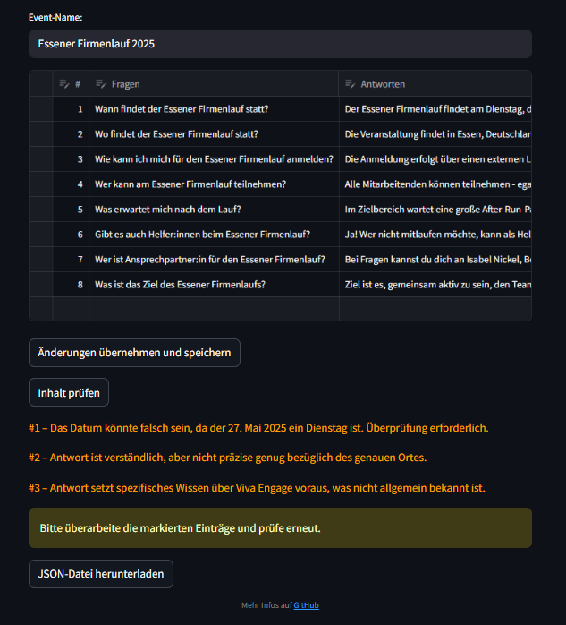

# opi‑bot — Interner Wissensassistent

<p align="center">
  
</p>

**opi‑bot** ist ein internes FAQ‑System auf Basis von Retrieval‑Augmented Generation (RAG).  
Alle Fragen‑ und Antwortpaare werden lokal als Vektoren in einer FAISS‑Datenbank gespeichert. Ein OpenAI‑Modell (Standard: **gpt‑4‑0125‑preview**) erzeugt daraufhin fundierte Antworten – ausschließlich aus dem gefundenen Kontext.

# Inhalt

- [Funktionsweise & Architektur](#funktionsweise--architektur)
- [Projektstruktur](#projektstruktur)
- [Installation](#installation)
- [Datenbank erstellen](#datenbank-erstellen)
- [Start der Anwendung](#start-der-anwendung)
- [Konfigurationen](#konfigurationen)
- [Admin-Panel](#admin-panel)

- [Anpassung an andere Fachbereiche](#8-anpassung-an-andere-fachbereiche)
- [Beispielausgabe](#beispielausgabe)


---

## Funktionsweise & Architektur

1. **Embedding‑Erstellung**  
   Die Texte der hochgeladenen JSON‑Datei werden in Vektoren umgewandelt und gruppen­weise in einer FAISS‑Indexstruktur abgelegt.

2. **Vektorsuche**  
   Bei einer Nutzerfrage werden die semantisch ähnlichsten Passagen gesucht (Cosine Similarity).

3. **Antwortgenerierung**  
   Nur diese Treffer werden dem LLM als _Kontext_ übergeben.  
   Ein strenger Prompt verhindert Halluzinationen und schränkt das Modell auf die interne Wissensbasis ein.

<p align="center">
  
</p>

---

## Projektstruktur

| Pfad / Datei                 | Zweck                                                          |
|------------------------------|----------------------------------------------------------------|
| `data/*.json`                | Quelldateien im Format `{"qa_pairs":[{"Fragen":…,"Antworten":…}]}` |
| `create_database.py`         | Erstellt/aktualisiert gruppenspezifische FAISS‑Indizes         |
| `faiss_index/<group>_index/` | Persistente Vektordatenbanken je Gruppe                        |
| `utils/qa_validator.py`      | LLM‑gestützte Qualitätskontrolle einzelner QA‑Paare            |
| `query_data.py`              | Vektorsuche + Antworterstellung (Prompting / Temperature)      |
| `streamlit_app.py`           | Web‑Frontend inkl. Admin‑Editor und Chat‑Interface             |

---

## Installation

```bash
# 1. virtuelle Umgebung
python -m venv .venv
source .venv/bin/activate          # Windows: .venv\Scripts\activate

# 2. Abhängigkeiten
pip install -r requirements.txt

# 3. Umgebungsvariablen (.env)
echo 'OPENAI_API_KEY=sk-…'     >> .env
echo 'GPT_MODEL=gpt-4-0125-preview' >> .env
```

---

## Datenbank erstellen

```bash
python create_database.py
```

Liest alle JSON‑Dateien im `data/`‑Ordner ein und erzeugt FAISS‑Indizes.
Bei Änderungen an den Quelldaten muss dieser Schritt erneut ausgeführt werden.

---

## Start der Anwendung

```bash
streamlit run streamlit_app.py
```

| Passwort | Rolle / Index  |
|----------|----------------|
| `azubi123`   | Azubis‑Index |
| `student456` | Studenten‑Index |
| `admin789`   | Admin‑Editor   |

---

## Konfigurationen

### Confidence‑Schwelle  
In `query_data.py`:

```python
if not results or results[0][1] < 0.5:
    return "KEINE PASSENDEN ERGEBNISSE …"
```

* Je niedriger der Wert, desto „kulantes“ Matching  
* Höhere Werte = weniger, dafür präzisere Antworten  

### Temperature  
```python
ChatOpenAI(model=model_name, temperature=0)
```
* `0` = deterministisch  
* `>0.5` = kreativer (empfiehlt sich bei FAQ **nicht**)

### Prompt: Charakter des Bots
Der verwendete Prompt bestimmt Ton, Sprachebene und Verhalten des Bots. 

Er ist jeweils angepasst auf Azubis oder Studierende und wird nur beim Aufruf dynamisch gesetzt. 

```python
prompt = ChatPromptTemplate.from_template(PROMPT_TEMPLATES[group])
prompt = prompt.format(context=context, question=query_text)
```

Der Prompt beeinflusst:
- den Sprachstil (z.B.locker, formell)
- wie präzise/fachlich geanwortet werden soll
- welche Rolle der Bot einnimmt (young talents-Buddy vs. Studienberater )

---

## Admin Panel

* **Leeres Template**: generiert X leere QA‑Zeilen als Download‑Datei  
* **JSON‑Import**: bestehende Events laden  
* **Live‑Tabellen‑Editor**: Zeilen hinzufügen, löschen, sortieren  
* **LLM‑Validierung**: prüft Verständlichkeit, Redundanz & Korrektheit

> **Ansicht des Admin Panels**




> **Beispielhafte Eingabe im Admin-Editor**



 

---

## Anpassung an andere Fachbereiche

1. Neue JSON mit passenden QA‑Pairs bereitstellen  
2. `access_mapping` & Passwörter ergänzen  
3. Prompt in `PROMPT_TEMPLATES` an Zielgruppe anpassen  
4. Index via `create_database.py` neu generieren  

---

## Beispielausgabe

---


---


## Autor

Enes Avsar 

