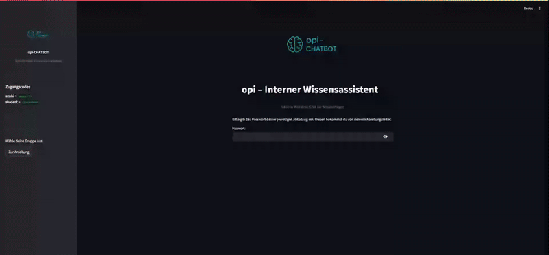
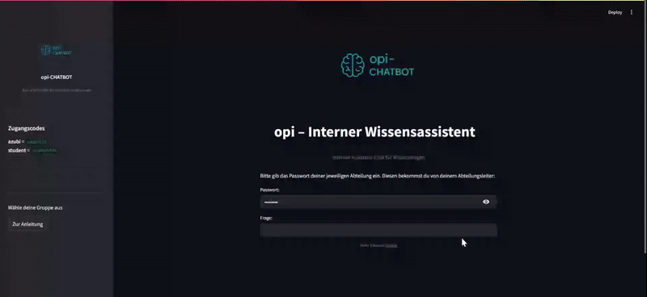

<p align="center">
  
</p>


# Demo: opi-bot@OD 

Dieses Projekt stellt eine interne Frage-Antwort-Anwendung bereit, die auf dem RAG-Ansatz (Retrieval-Augmented Generation) basiert. Die Daten aus einer json-Datei werden lokal in einer FAISS-Vektordatenbank gespeichert. 

Die Antwortgenerierung erfolgt mithilfe der openai api (gpt-4-0125-preview).


## Funktionsweise

Das System durchsucht auf Basis eines Embedding-Vergleichs (Vektorsuche) die relevantesten Einträge in der Datenbank und stellt dem OpenAI-Modell (z. B. GPT-3.5) diese als Kontext zur Verfügung. Nur basierend auf diesem Kontext wird eine Antwort erzeugt.


In der Oberfläche fragt das Tool nach einem Passwort, das die Gruppe identifiziert. Dadurch wird gezielt der passende Index verwendet.



Der [Faiss Index](https://faiss.ai/index.html) ist eine vektorbasierte Datenbank. Dabei werden alle Texte in Vektoren umgewandelt, um bei Anfragen die inhaltlich ähnlichsten Dokumente effizient zu finden. 

## Einrichtung

### 1. Virtuelle Umgebung erstellen und aktivieren (.venv)
```bash
python -m venv .venv
.\.venv\Scripts\activate
```

### 2. requirements installieren
```bash
pip install -r requirements.txt
```

### 3. environment definieren
Lege eine Datei `.env` an (oder kopiere `.env.example`) mit folgendem Inhalt:
```env
OPENAI_API_KEY=your-api-key-here
GPT_MODEL=gpt-4-0125-preview
```


## Nutzung

### 1. Datenbank erzeugen (mehrdimensional)
```bash
python create_database.py
```

Dieser Schritt liest beide Gruppen-Dateien (azubis.json, studenten.json) ein, splittet die Antworten in Text-Chunks und erstellt getrennte FAISS-Datenbanken.

Nach erfolgreicher Ausführung sollten im Ordner `faiss_index/` zwei neue Unterverzeichnisse vorhanden sein:
- `azubi_index/`
- `student_index/`


### 2. Anwendung starten (streamlit)
```bash
streamlit run streamlit_app.py
```

Danach kann im Browser eine FAQ-Frage an den chatbot gestellt werden. 
Das System erkennt die Gruppe anhand des Passworts (group = access_mapping.get(password.strip().lower())) und leitet die Eingabe korrekt weiter.


## Projektstruktur

| Datei / Ordner     | Beschreibung |
|--------------------|--------------|
| `create_database.py` |erzeugt gruppenspezifische FAISS-Indizes aus JSON-Dateien|
| `query_data.py`     | durchsucht die Datenbank  und generiert eine Antwort (fragt relevanten index ab => generiert antwort|
| `streamlit_app.py`  | frontend in streamlit mit passwortlogik und Benutzer UI |
| `data/`             | enthält die json-Datenquelle, bei formatabweichung diese Logik dem programm anpassen! |
| `faiss_index/`      | persistente Vektordatenbank (wird automatisch erstellt mit create_database.py), muss nach änderung der datensatzes neu gestartet werden |
| `.env.example`      | Vorlage für .env |


## Beispielausgabe

---


---

## Anpassung des Confidence Scores

Um die Relevanz einer Antwort zu bewerten, wird ein sogenannter Confidence Score verwendet. 

Dieser Wert liegt zwischen `0` und `1` und gibt an, wie sicher das System ist, dass der zurückgegebene Kontext zur gestellten Frage passt.

### Snippet zur Anpassung

In der Datei `query_data.py` (bzw. wo die `run_query()`funktion also liegt), kann der Confidence Score angepasst werden. Die Standardgrenze für die ich mich entschieden habe liegt bei `0.5`.

```python
if not results or results[0][1] < 0.5:
    return "KEINE PASSENDEN ERGEBNISSE GEFUNDEN. Bitte versuche es mit einer anderen Frage."
```

Durch Erhöhung oder Senkung dieser Grenze bzw. dieses Wertes lässt sich das Antwortverhalten feinjustieren:

---

### Visualisierung der Auswirkungen

Die folgenden Diagramme zeigen, wie sich unterschiedliche Scores auf die Erkennung von passenden Antworten auswirken:

#### Nicht passende Antworten (Incorrect Responses)
Antworten mit Score < 0.5, obwohl sie keine wirkliche Verbindung zur Frage haben:

```python
if not results or results[0][1] < 0.29:
```


#### Passende Antworten (Correct Responses)
Hohe Scores (ab 0.7) – hier besteht starke Übereinstimmung zwischen Frage und gefundenem Kontext:

```python
if not results or results[0][1] < 0.86:
```


---

Je nach Use Case (präzision oder kulanz) ist dieser Wert frei anpassbar!

---

## Temperature-Wert

Die Modellantwort wird in `query_data.py` wie folgt erzeugt:
```python
model = ChatOpenAI(model=selected_model, temperature=0)
```

### Wirkung des Temperature-Werts
| Einstellung        | Wirkung                                                                 |
|--------------------|-------------------------------------------------------------------------|
| `temperature = 0`  | Antwort ist konstant, vorhersehbar, sachlich                             |
| `temperature = 1`  | Antwort ist kreativ, ausschweifend, potenziell ungenau (Halluzination) |

Die Einstellung ist bei diesem FAQ-System ist sinnvoll, da gleiche Fragen auch gleiche Antworten liefern sollen.

### Prompt: Charakter des Bots
Der verwendete Prompt bestimmt Ton, Sprachebene und Verhalten des Bots. 

Er ist jeweils angepasst auf Azubis oder Studierende und wird nur beim Aufruf dynamisch gesetzt. 

```python
prompt = ChatPromptTemplate.from_template(PROMPT_TEMPLATES[group])
prompt = prompt.format(context=context, question=query_text)
```

Der Prompt beeinflusst:
- den Sprachstil (z.B.locker, formell)
- wie präzise/fachlich geanwortet werden soll
- welche Rolle der Bot einnimmt (young talents-Buddy vs. Studienberater )

---


## Skalierung auf andere Use Cases

Diese Demo lässt sich leicht auf andere use cases übertragen:

**Beispielhafte Use Cases:**
- internes IT-Wissenssystem (jira knowledge base)
- Infrastructure Inventory Assistant
- Mitarbeiter-Onboarding FAQ
- Schulungssystem für verschiedene Abteilungen

**Anpassungsschritte:**

1. **Prompt anpassen:**  
   In `query_data.py` oder `PROMPT_TEMPLATES` einen neuen Prompt für die Zielgruppe hinterlegen (z. B. "Du bist ein KI-Assistent für Systemadministratoren, etc...").

2. **Neue JSON-Datei:**  
   Struktur: `{"qa_pairs": [{"Fragen": ..., "Antworten": ...}]}`

3. **Datenbank-Erstellung:**  
   `create_database.py` um neue Gruppe ergänzen im faiss index(z. B. "infra": "data/infra_qa.json")

4. **Frontend erweitern:**  
   In `streamlit_app.py` ein weiteres Passwort zur Gruppen id (access_mapping) hinzufügen.

5. **Index-Auswahl:**  
   Gruppenspezifisch den richtigen faiss index laden

---


## Autor
Enes Avsar
